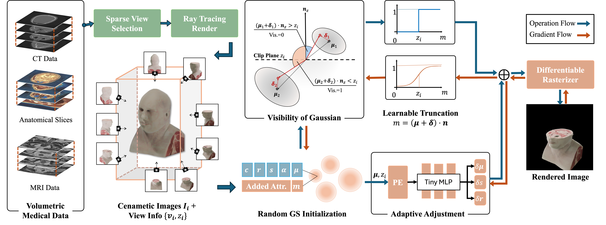

<br />
<p align="center">

  <h1 align="center">ClipGS: Clippable Gaussian Splatting for Interactive Cinematic Visualization of Volumetric Medical Data</h1>

  <p align="center">
   MICCAI, 2025
    <br />
    <a href="https://github.com/chengkunli96/"><strong>Chengkun Li</strong></a>
    ·
    <a href="https://dblp.org/pid/239/9969.html"><strong>Yuqi Tong</strong></a>
    ·
    <a href="https://ck-kai.github.io/"><strong>Kai Chen</strong></a>
    ·
    <a href="https://scholar.google.com/citations?user=4nk3hAgAAAAJ&hl=en"><strong>Zhenya Yang</strong></a>
    ·
    <a href="https://www.researchgate.net/profile/Ruiyang_Li9"><strong>Ruiyang Li</strong></a>
    ·
    <a href="https://shiqiu0419.github.io/"><strong>Shi Qiu</strong></a>
    ·
    <a href="https://www.med.cuhk.edu.hk/staff/dr-chan-ying-kuen-jason"><strong>Jason Ying-Kuen Chan</strong></a>
    ·
    <a href="http://www.cse.cuhk.edu.hk/~pheng/"><strong>Pheng-Ann Heng</strong></a>
    ·
    <a href="http://www.cse.cuhk.edu.hk/~qdou/"><strong>Qi Dou</strong></a>
  </p>

<!-- <p align="center"> 

</p> -->

  <p align="center">
    <!-- <a href='https://xxxxxxxx'>
      </a> -->
    <a href='https:xxx'></a>
    <a href='https://med-air.github.io/ClipGS/' style='padding-left: 0.5rem;'>
      </a>
    <!-- <a href='https://colab.research.google.com/drive/1imGIms3Y4RRtddA6IuxZ9bkP7N2gVVC_' style='padding-left: 0.5rem;'></a> -->
    <!-- <a href='https://youtu.be/lCc1rHePEFQ' style='padding-left: 0.5rem;'>
      </a> -->
  </p>

</p>
<br />

This repository contains the pytorch implementation for the paper [ClipGS: Clippable Gaussian Splatting for Interactive Cinematic Visualization of Volumetric Medical Data](https://github.com/med-air/ClipGS), MICCAI 2025. In this paper, we proposed a novel GS-based framework that can render volumetric medical data with clipping planes with photorealism and real-time. 

## Overview


## Code Coming Soon !

## 📝 Citation
Welcom to cite our work, If you find it is useful for your research.
```
```

## 🙋‍♀️ Feedback and Contact
For further questions, pls feel free to contact [Chengkun Li](mailto:chengkunli@link.cuhk.edu.hk).
